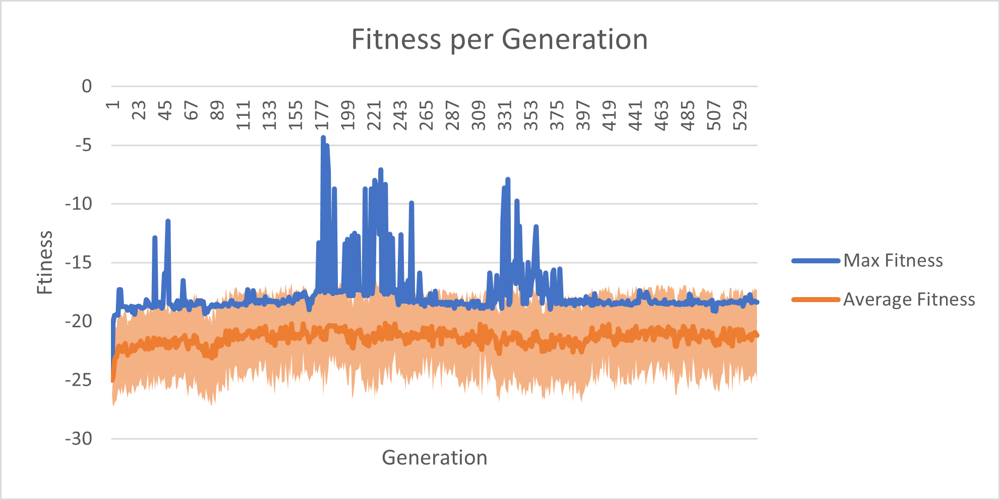

# AiAi AI
Super Monkey Ball AI using NEAT and YOLO


## Contents
1. [Project Description](#Project-Description)
    1. [Technologies Used](#Technologies-Used)
1. [Inspiration & Purpose](#Inspiration-And-Purpose)
1. [Results](#Results)
    1. [Hardware Specs](#Hardware-Specs)
    1. [Graphs](#Graphs)
1. [How To Use](#How-To-Use)
    1. [Dolphin Emulation Config](#dolphin-emulation-config)
    1. [Requirements](#requirements)
    1. [Hotkey Config](#hotkey-config)
    1. [Controller Config](#controller-config)
    1. [Save State Setup](#save-state-setup)
    1. [Launch AI Agent](#launch-ai-agent)
    1. [Customizing Options](#Customizing-Options)
        1. [Runtime Arguments](#runtime-arguments)
        1. [Network](#network)
        1. [Goal Detection](#goal-detection)
    1. [Known Issues](#Known-Issues)

## Project Description
This repository contains the excessive work completed in an attempt to create an artificial intelligence agent in the game *Super Monkey Ball*.

### Technologies Used
This project utilizes two technologies: [NEAT](https://github.com/CodeReclaimers/neat-python) and [YOLO](https://github.com/ultralytics/yolov5). The game is expected to be played on the [Dolphin Emulator](https://dolphin-emu.org).

#### NEAT
NEAT (Neural Evolution of Augmented Topologies) is the primary mechanism utilized in this projects. To facilitate the evolution, the `aiai_ai.py` script runs the `neat-python` library. After a genome is initialized, a screenshot is taken at each interval in the script. This screenshot is then analyzed by the generated model and an action is determined accordingly. To determine the resulting state's fitness, the screenshot is evaluated to see if it is one of three states `[TIME OVER, FALL OUT, GOAL]`.


In the `GOAL` state, the genome's fitness is determined by how quickly it reached the Goal, based on the following equation: `30 + 1.25 * time_remaining` where the fitness of the `GOAL` state is between `[30, 105]`.

The `TIME OVER` and `FALL OUT` states are more complicated to calculate. A problem arose of how to have a more granular fitness beyond a simple state check. To resolve this, it was determined to include a value representing how close the genome made it to the Goal before failing (see the [YOLO section](#YOLO) for more information). If a genome got as close to the Goal as possible, but still failed, it would be awarded a fitness score of 50. If the end-state was `TIME OVER` or `FALL OUT` this score would be modified by -25 points.

The highest fitness score during a given genome's runtime will be the score evaluated during population reproduction.

#### YOLO
YOLO (You Only Look Once) is used as a metric of determining how close a given genome is to the Goal. In short, the YOLO model detects the size and location of the Goal (if one is present), returning a bounding box of the Goal. The area of the bounding box is used to calculate the percentage of the screen the Goal occupies. If the Goal occupies at least 40% of the screen, the given genome will be given the max reward possible for `TIME OVER` or `FALL OUT` states.

## Inspiration And Purpose
The design of this project was largely inspired by SethBling's [MarI/O](https://www.youtube.com/watch?v=qv6UVOQ0F44). The inspiration of starting this project came from my wife holding three [World Records](https://www.speedrun.com/smbbm) in *Super Monkey Ball: Banana Mania* speedruns (as of April 4th, 2022). I simply wanted to feel better about my inadequacy in this series.

The purpose of this project is to create a Super Monkey Ball AI that can reasonably beat standard stages in the game.

## Results
AiAi AI was tested on three stages: Beginner Floor 1, Beginner Floor 2, and Beginner 7.

### Hardware Specs
All results were conducted on the following specs

```
Windows 10
NVIDIA RTX 3060
AMD Ryzen 5 3600 6-Core Processor 3.95 GHz
16 GB RAM
```

With these specs, and default configurations, the AI is able to analyze the game at approximately 30 FPS, essentially every other frame of the game.

### Graphs
So far, the AiAi AI has been tested on beginner floors 1, 2, and 7. These were chosen for their relative simplicity in layout, allowing for an easier evolution for the population.

#### Floor 1


Due to it's nature, [Floor 1](https://supermonkeyball.fandom.com/wiki/Plain) is the simplest stage, only requiring the player to move straight ahead. Because of it's simplicity, it did not take long for the population to surpass the max expected fitness score of `101`. Therefore, to gain further information about the population's evolution, a second run was conducted to see how high the average fitness for the population could achieve. The results are graphed below.

##### First Run


##### Second Run


#### Floor 2


Beginner [Floor 2](https://supermonkeyball.fandom.com/wiki/Diamond) adds complexity to Floor 1 by having a gap in the middle of the stage. As the graph shows, it took the population a significant amount of generations to reach a higher maximum fitness. For this stage, the expected fitness threshold was `99.5`. However, the population only reached a maximum of `98.76`. After 323 generations, the process was halted.


#### Floor 7


[Floor 7](https://supermonkeyball.fandom.com/wiki/Steps) was a significant increase in complexity to test the overall capabilities of the system. The expected fitness threshold was set to `90`. However, the population never officially crossed the goal. Despite this, there was significant progress made towards reaching the goal. The population almost reached the goal several times, but not close enough to get the fitness score out of the negatives.



## How To Use
To utilize this project, be sure to have a working version of the [Dolphin Emulator](https://dolphin-emu.org) installed on your machine, along with a ROM of [Super Monkey Ball for GameCube](https://en.wikipedia.org/wiki/Super_Monkey_Ball_(video_game)). The project can be downloaded onto your local machine using the following command:

```
git clone https://github.com/AlexTheM8/AiAi-AI.git
```

### Dolphin Emulation Config
For best results, the following settings should be configured for the Dolphin Emulator.

- In Graphics settings, General, aspect ratio should be set to `Auto` or `Force 3:4`
- In Graphics settings, General, `Auto-Adjust Window Size` should be checked
- In Graphics settings, Enhancements, Internal Resolution should be set to `Native 640x528`
- In Config, Interface, `Keep Window on Top` should be checked
- In Config, Interface, `Show On-Screen Display Messages` should be un-checked
- In Config, Interface, `Show Active Title in Window Title` should be checked
- In Config, Interface, `Pause on Focus Loss` should be un-checked

### Requirements
The code of this project was programmed using `Python 3.9.0` on a Windows 10 machine. It is currently unknown if this project is functional in any other Python version or OS.

Once downloaded, navigate into the project folder and execute the following command to install the Python dependency libraries:

```
pip install -r requirements.txt
```

If necessary, additional requirements can be installed by executing the following command:

```
pip install -r ./yolov5/requirements.txt
```

<details>
  <summary><b>Additional instructions for CUDA-enabled devices</b></summary>
  
  If you are running a CUDA-enabled device, execute the following command:
  
  (For CUDA 10.2)
  ```
pip install torch==1.10.2+cu102 torchvision==0.11.3+cu102 torchaudio===0.10.2+cu102 -f https://download.pytorch.org/whl/cu102/torch_stable.html
  ```
  
  (For CUDA 11.3)
  
  ```
pip install torch==1.10.2+cu113 torchvision==0.11.3+cu113 torchaudio===0.10.2+cu113 -f https://download.pytorch.org/whl/cu113/torch_stable.html
  ```
</details>

### Hotkey Config
Prior to executing the program, the virtual gamepad needs to be initialized. To do so, the `controller.py` must be configured executed.

Pulling up the Dolphin hotkey controls, navigate to the `Save and Load State` tab (see below). 


Once there, execute the following command:

```
python controller -s load
```

This will set the controller to repeatedly press the virtual button designated to loading the game's state. Follow these steps to configure the `Load State` hotkey.
 
1. In the Dolphin hotkeys menu, at the `Device` dropdown, select the virtual gamepad (multiple devices may be listed, so repeat steps 2-4 with a different device until the correct device is found)
1. Click on the `Load State Slot N` (where N can be any number you choose. **Remember this number**) box
1. Wait for `Button 3` to appear in the box
1. Repeat steps 2 & 3 a few times if it does not appear immediately
1. You should then see `Button 3` flash bold multiple times
1. Terminate the `controller.py` process
1. **[OPTIONAL]** Save the configuration as a `Profile` in Dolphin to avoid the need to repeat this process in the future


### Controller Config
For the joystick controls, navigate to the Dolphin controller config menu.


To configure the joystick in Dolphin, follow these steps:

1. Execute the command `python controller -s up`
1. In the Dolphin controller config menu, select the `Device` corresponding to the virtual gamepad (as described in [Hotkey Config](#hotkey-config), the device is not universally labeled, so steps 3-5 may need to be repeated until device is found)
1. Under the `Control Stick` section, click the box next to `Up`
1. Wait for `Axis Y-` to appear in the box
1. Repeat steps 3 & 4 a few times if it does not appear immediately
1. You should then see `Axis Y-` flash bold multiple times along with a visual representation of the joystick moving in the visual above
1. Terminate the `controller.py` process
1. Repeats steps 1-7 for each of the directions `[down, left, right]`, replacing each instance of "up" with the corresponding direction (`Axis Y+` for down, `Axis X+` for left, `Axis X-` for right)
1. **[OPTIONAL]** Save the configuration as a `Profile` in Dolphin to avoid the need to repeat this process in the future
1. **[OPTIONAL]** To test the controller configuration, execute the command `python controller -s random`. The virtual joystick should be moving appropriately


### Save State Setup
The evolution process requires a save state to be accessible as this is how the agent resets the game state upon starting a new genome. Please refer to [Hotkey Config](#hotkey-config) before configuring the save state. 

1. In the *Super Monkey Ball* game, navigate to the preferred stage (**Note**: if you are just starting out the game and do not want to play through the game to access later stages, please refer to [this Wiki](https://tcrf.net/Super_Monkey_Ball_(GameCube)#Debug_Mode) for more information on how to access all levels easily)
1. Save the game state at the start of the stage (before any time passes) in the same `Save Slot` chosen in the [Hotkey Config](#hotkey-config) step (**Note**: for a more-precise save state, use the frame-advance TAS tools provided by Dolphin)
1. Feel free to use the original code in `controller.py` to test if the save state (and corresponding hotkey) are configured appropriately (see [Hotkey Config](#hotkey-config)).

### Launch AI Agent
Once all the previous steps are completed, launch the *Super Monkey Ball* ROM on Dolphin and execute the following command:

```
python aiai_ai
```

From there, you should see the program load up the save state and begin evolution.
 
 **IMPORTANT**: After starting evolution DO NOT MOVE THE EMULATION WINDOW. If you want to move the window, restart the program.

### Customizing Options
To customize behavior, there are some options and features available in the AiAi AI. These options include logging and stat-tracking as well as network customization options.

#### Runtime Arguments
To customize the amount of messages displayed when running, there are three logging options: `[FULL, PARTIAL, NONE]`. The `FULL` logging option (enabled by default) will display all available logs during evolution. The `PARTIAL` logging option will display the max fitness of the most-recently executed genome along with the default NEAT logs. The `NONE` logging option will only display the default NEAT logs.

```
python aiai_ai --logging full
                -l       partial
                         none
```

Along with the evolution logging, there is a stat-tracking document that saves the max fitness, mean fitness, and standard deviation of each generation (saved as a CSV file labeled `stats.csv`). This file is enabled by default, but can be disabled as an execution parameter.

```
python aiai_ai --stats
                -s
```

To speed up evolution, there is a feature where a given genome will be terminated early if it is not moving for too long. This is enabled by default, but can be disabled at execution. **NOTE:** feature should be disabled for stages that may require the player to wait.

```
python aiai_ai --zero_kill
                -z
```

On Windows systems, a magnification can be applied to the display. Because of this, there is a runtime argument to set the magnification of the used display.

```
python aiai_ai --window_scale 1.0
                -w            1.0
```

Scale must be set as a `float` (ex. 1.0, 1.25, 1.5, etc). **NOTE:** Scale has only been tested for 1.0 and 1.25

#### Network
As part of the NEAT library, the neural network can be customized in a number of ways. For a full description of all customization options, see the [NEAT documentation](https://neat-python.readthedocs.io/en/latest/index.html). Some of these options in the `config-feedforward` document will be highlighted here.

In the `[NEAT]` section, the `fitness_threshold` can be adjusted for the given stage where the fitness can be between `[-50, 105]`. The `pop_size`, or "population size" can be customized, where this number will correspond to how many genomes are in each generation.

Under the `network parameters` category of the `[DefaultGenome]` section, the `num_inputs` will be dependent on your window configurations. Best way to know what the `num_inputs` should be set to is by running the AiAi AI program (see [Launch AI Agent](#launch-ai-agent)) and change the value to the received value, in case of execution failure. See the example below.

```
File "c:\neat-python\neat\nn\recurrent.py", line 27, in activate
    raise RuntimeError("Expected {0:n} inputs, got {1:n}".format(len(self.input_nodes), len(inputs)))
RuntimeError: Expected 1425 inputs, got 5967
```

In this example, `num_inputs` should be set to 5967

#### Goal Detection
The YOLO goal-detection is the primary method of determining a more granular fitness. The main method of customization is through the model training. Please refer to the [YOLO documentation](https://github.com/ultralytics/yolov5) for more information on training customization. To ensure the goal-detection matches the YOLO model, the `size` parameter in the following line in `aiai_ai.py` should match the specifications made in training.

```
ref = model(cv2.cvtColor(img, cv2.COLOR_BGR2GRAY), size=320)
```

### Known Issues
Below is a list of known issues with the current project.

- In the `neat-python` library, there is an occasional issue with population reproduction after a species stagnates where an assert with the `node_dict` will fail. This is due to a naive assert check for the stored indexer. The fix can be found on the `Revisions` branch of [my personal fork of the library](https://github.com/AlexTheM8/neat-python), which can be pulled and installed locally.
- Another minor issue with the `neat-python` library is that the `Checkpoint` feature does not save the best genome after each generation. Whether this is an intentional design is debatable. However, this requires the user to specify a fitness threshold for the system to exceed to consider it a "solved" problem. In the design of this project, a stage-specific max fitness was not intended. Instead, it was largely expected for the evolution to find the best potential solution before stagnating and going extinct. This issue can be resolved by either setting an expected max fitness, or by utilizing the changes on the `Revisions` branch of [my personal fork of the library](https://github.com/AlexTheM8/neat-python).
- The 0mph genome time-out feature is not always effective at timing out a genome, but still helps at filtering out zero-movement genomes.
